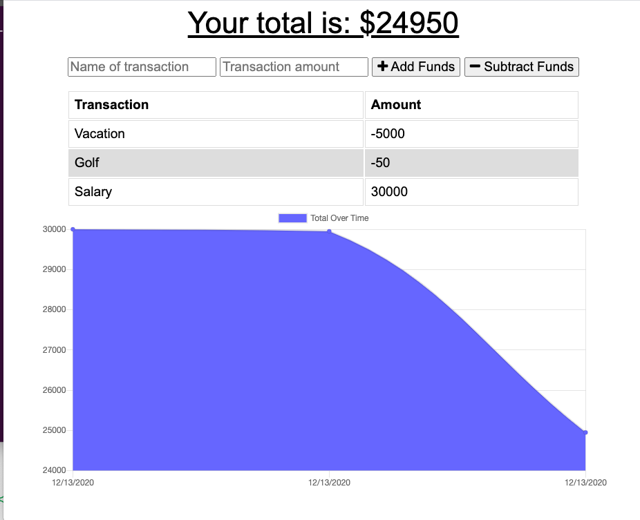

# My Budget Tracker

## Description
An online budget tracker with offline functionality. A user can enter transactions to either credit or debit their accounts. A graph will show the credits and expenses. 
***
## Table of Contents
[Installation](#installation) 
[Usage](#usage) 
[Contributing](#contributing) 
[Tests](#tests) 
[License](#license) 
[Questions](#questions) 
***
## Installation
Install by typing "npm install" to install the Node dependencies. To run the application type "npm start" in the terminal. 

## Usage
Use My Budget Tracker to track expenses. Enter money coming into and out of your account. When the user is offline, the user can enter transactions and when the connection is restored, the transactions will be saved to the database.

This application is deployed to Heroku: https://my-budget-2020.herokuapp.com/

## Contributing

## Tests

## License
### This license is covered under the GNU license(s):
* The GNU General Public License (GNU GPL or simply GPL) is a series of widely-used free software licenses that guarantee end users the freedom to run, study, share, and modify the software.
***
## Questions
For more information contact me at: 
* Name: aksmith5239
* GitHub: https://github.com/aksmith5239/my-budget-tracker
* Email Address: aklobby@gmail.com
    